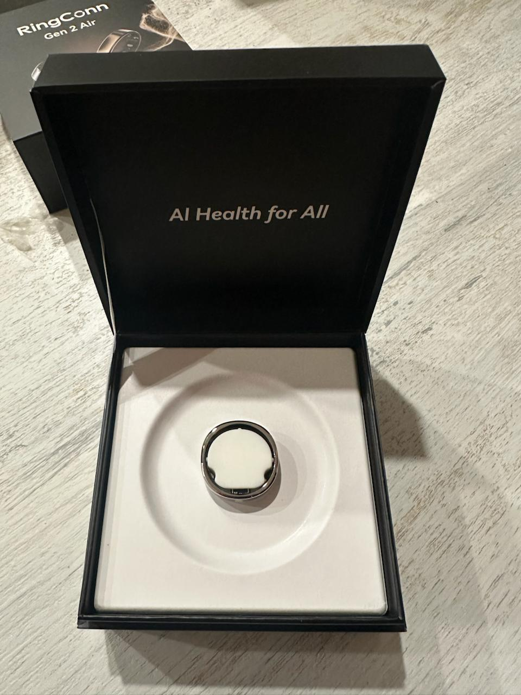
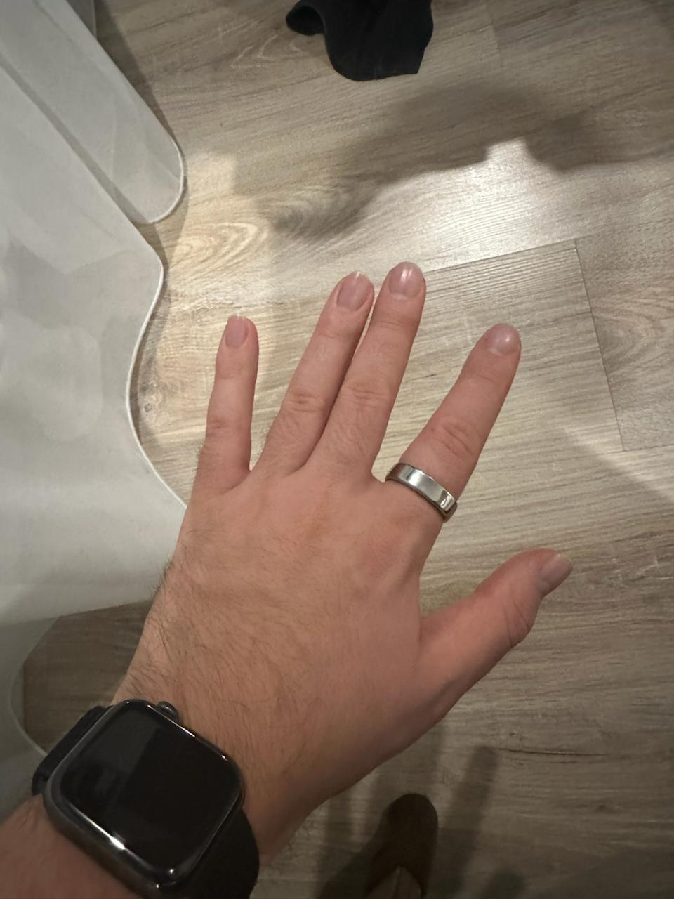

# 💍 Умное кольцо или фитнес браслет

## Отчёт о подаренном

Бомба пушка гонка! Спать с кольцом гораздо комфортнее, чем с часами. Заряд они неделю держут, как минмум и на тренировках не мешается. ❤️

## Зачем

Я активный трекатель своего здоровья — качество сна, пульс на тренировках, вариативность пульса и так далее. Сейчас активно пользуются Apple Watch, но с этим устройством есть какое-то количество минусов:

- Часы большие и с ними не очень комфортно спать. Тем более, что я хочу обновиться до Ultra, где всё будет ещё сложнее 🥴
- Их нужно часто заряжать, а эко-система Apple с автоматическими ночными обновлениями намекает, что ночью часы могли бы и на зарядке постоять. Но я хочу трекать сон!
- Во время тренировок часы упираются в запястье, если я нахожусь в упоре лёжа или как-то загибаю кисти. Это не очень приятно.

## Что по вариантам

Мне концептуально нравятся браслеты Whoop и кольца Oura. Однако, оба продукта недоступны в России, а у первого ещё и дурацкая система подписки.

Нашёл интересный вариант с [RingConn](https://ringconn.ru/), выглядит очень заманчиво.
